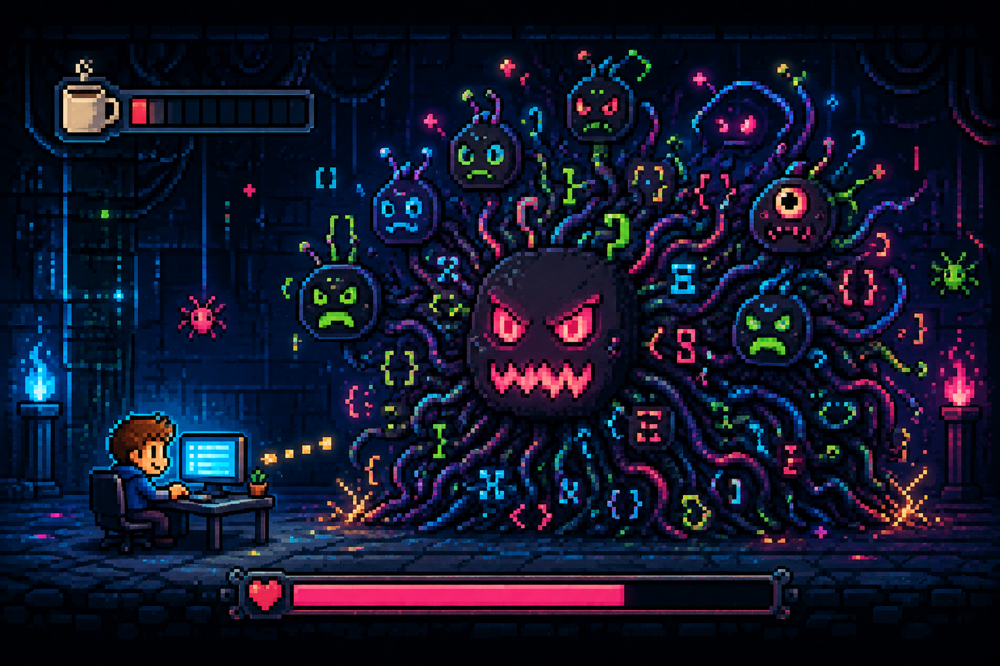

# Taizhen Cheung

  
  
  
  

 

 

<code>You must defeat my tech debt to stand a chance!</code>

---

## About me

I'm a software engineer in New York City building **AI evaluation systems**, **retrieval pipelines**, and **full-stack products** with Python and TypeScript.

- 🎓 Computer Science and Mathematics at Hunter College — graduating May 2027
- 🔭 Currently building Onward and stress-testing RAG pipelines
- 🎮 Outside of code: Street Fighter 6, Sagat main, Master rank

I care about evaluation that tells the truth, retrieval that can be inspected, and software that survives outside the demo.

## Tech stack

  <strong>Languages</strong>
   
  

  <strong>Frontend</strong>
   
  

  <strong>Backend &amp; data</strong>
   
  

  <strong>Machine learning &amp; tools</strong>
   
  

## `> RANDOM_ENCOUNTER`

  

## `> PLAYER_STATS`

  
   
  

---

  
   
  

